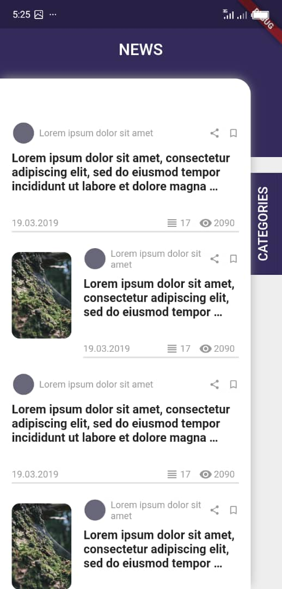
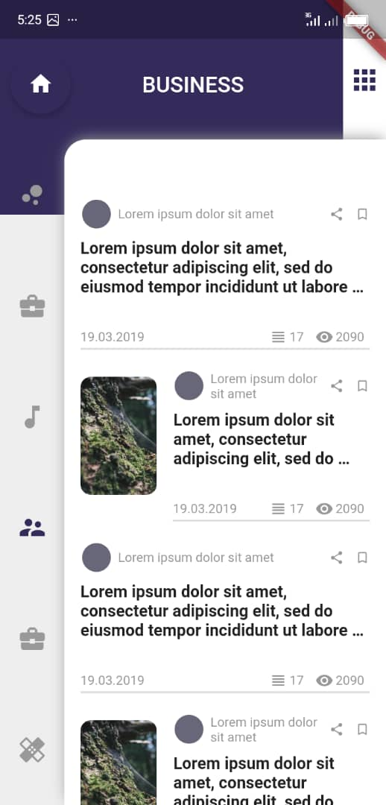

# Day 4 and 5
## 30 days of Code via @try30daysofcode. 

Day 4 - A news app UI implementation with news categorisation.
Inspiration from Behance

<a href="https://www.behance.net/gallery/82537771/Political-News-App?tracking_source=search_projects_recommended%7CNews%20app"> behance inspiration</a>

Day 5 - Implementation of real time data using API. API used NEWSAPI

at <a href="newsAPI.org">newsapi.org</a>
  
## App Screenshots for Day 4
### Page showing all available news

### Page showing one news category

### Page showing all news category for selection

## App Screenshots for Day 5
#### Main page

#### Main page. If no image exists for news, different style used.

#### Category Grid Page

#### Category View Page

#### Category View Page while waiting
" width= "200">

#### Category page while network image loads
" width="200">
